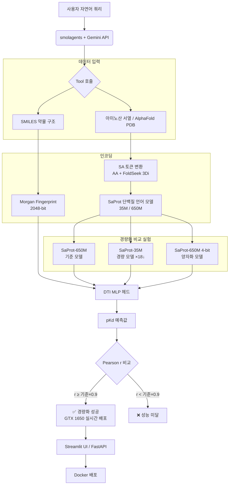

# [Capstone Project] Agentic FusionDTI: 저사양 환경을 위한 지능형 신약 재창출 플랫폼

## 1. 프로젝트 개요

본 프로젝트는 최신 단백질 언어 모델 **SaProt**을 경량화하여, 보급형 GPU(GTX 1650, 4GB)에서도 실시간 **약물-표적 상호작용(DTI)** 예측이 가능한 지능형 플랫폼을 구축하는 것을 목표로 한다.

---

## 2. 핵심 가설

> **"SaProt-650M 대비 SaProt-35M(경량 백본) 또는 4-bit 양자화 모델이**
> **Pearson r 기준 90% 이상을 유지하면서, VRAM 사용량을 80% 이상 줄일 수 있는가?"**

검증 벤치마크: DAVIS 데이터셋 (연속 pKd 회귀, 30,056 쌍)

---

## 3. 기존 방법 대비 차별점

### DeepPurpose 표준 방식 (기존)

```
SMILES ──→ [MPNN 약물 인코더  ]  ─┐
                                   ├──→ [결합 레이어] → pKd
AA서열 ──→ [CNN  단백질 인코더]  ─┘
          ↑___________________________↑
              전체를 DAVIS로 end-to-end 학습
```

- 약물·단백질 인코더 + 헤드를 **처음부터 DAVIS로 전부 학습**
- 사전학습 모델(`MPNN_CNN_DAVIS`) 제공, 바로 사용 시 Pearson r ≈ 0.88
- 단점: 단순한 분자 지문/CNN 인코더 → 단백질 구조 정보 미반영

### 본 연구 방식 (SaProt 기반)

```
SMILES ──→ [Morgan FP (2048-bit)] ──────────────────────┐
                                                         ├──→ [DTI MLP 헤드] → pKd
AA서열 ──→ [SA 토큰 변환] → [SaProt (구조 인식 PLM)] ───┘
                                    ↑
                        아미노산 + FoldSeek 3Di 구조 정보
```

- **SaProt**: 아미노산 서열 + 3D 구조 정보(SA 토큰)를 함께 인코딩하는 단백질 언어 모델
- 단백질 인코더를 frozen 상태로 고정 → 작은 DTI 헤드만 DAVIS로 학습
- GTX 1650(4GB)에서 학습 가능, 헤드 학습 시간 ~1분

---

## 4. 전체 파이프라인



---

## 5. 현재 진행 상태

> **📍 Phase 1 진행 중 — Reference Score 확보 (목표: r ≥ 0.8)**

| 버전 | 방법 | Pearson r | 상태 |
|------|------|----------|------|
| V1 | SaProt-650M (랜덤 헤드, CPU) | 0.030 | ❌ 입력 오류 |
| V2 | SPRINT + panspecies-dti 가중치 | 0.141 | ❌ OOD 문제 |
| **V3-650M** | **SaProt-650M frozen + MLP 헤드** | **0.7855** | ✅ 현재 최고 |
| **V3-35M** | **SaProt-35M frozen + MLP 헤드** | **0.7832** | ✅ 650M 대비 -0.0023 |
| V3-4bit | SaProt-650M 4-bit + MLP 헤드 | — | 🔧 재실행 예정 |

**핵심 발견:** 35M 모델이 파라미터 약 18배 적음에도 650M 대비 성능 차이 0.0023 (사실상 동일)

---

## 6. r ≥ 0.9 달성 전략 (향후 연구 방향)

현재 frozen 방식의 한계: SaProt이 단백질-약물 상호작용을 모른 채로 특징만 추출.

### 단기 (Phase 1 완료 목표)

| 방법 | 예상 효과 | VRAM 증가 |
|------|---------|----------|
| **LoRA 파인튜닝** (권장) | r ≈ 0.85~0.92 | ~200MB |
| 에폭 확대 + LR 스케줄 조정 | r ≈ 0.80~0.82 | 없음 |
| SaProt 마지막 레이어 일부 unfreeze | r ≈ 0.83~0.88 | ~500MB |

**LoRA 전략 상세:**
```
SaProt 어텐션 레이어에 rank-16 LoRA 어댑터 추가
→ 추가 파라미터: ~2M개 (전체의 0.3%)
→ SaProt이 DAVIS DTI 태스크에 맞게 적응
→ 35M + LoRA가 frozen 650M을 넘어설 수 있음
```

### 장기 (Phase 2~3)

```
Phase 2:  LoRA-35M vs LoRA-650M vs 4bit 비교 → 경량화 트레이드오프 분석
Phase 3:  smolagents + Gemini API 에이전트 연동 → 자연어 DTI 예측
Phase 4:  Streamlit UI + FastAPI 백엔드
Phase 5:  Docker 이미지 배포
```

---

## 7. 실행 방법

### 로컬 (frozen, 빠름 ~1분)

```bash
# 환경 설치
bash setup_env.sh

# frozen 모드 (임베딩 캐시 → 헤드만 학습)
python train_dti_saprot.py --encoder 650M          # 기준 모델 (r=0.7855)
python train_dti_saprot.py --encoder 35M            # 경량 모델 (r=0.7832)
python train_dti_saprot.py --encoder 650M --quant 4bit  # 양자화
```

### Google Colab T4 (LoRA, 권장)

> GTX 1650에는 Tensor Core가 없어 LoRA 학습이 에폭당 ~2.5시간 소요.
> Colab T4는 에폭당 ~10분으로 대폭 단축.

**실행:** `notebooks/train_lora_colab.ipynb` 열기 → T4 런타임 선택 → 순서대로 실행

```bash
# LoRA 파인튜닝 (Colab 환경)
python train_dti_saprot.py --encoder 35M --lora          # 핵심 실험 (0.55M params)
python train_dti_saprot.py --encoder 650M --lora         # 풀 모델 비교
```

### 주요 인자

| 인자 | 옵션 | 기본값 |
|------|------|--------|
| `--encoder` | `650M`, `35M` | `650M` |
| `--quant` | `none`, `4bit`, `8bit` | `none` |
| `--lora` | flag | off |
| `--lora_r` | 정수 | `16` |
| `--epochs` | 정수 | `50` |
| `--patience` | 정수 | `10` |

---

## 8. 기술 스택

| 분류 | 스택 |
|------|------|
| 단백질 인코더 | SaProt (35M / 650M AF2), SA 토큰 (AA + FoldSeek 3Di) |
| 약물 인코딩 | RDKit Morgan Fingerprint (radius=2, nBits=2048) |
| 경량화 | bitsandbytes (4-bit NF4 양자화), LoRA (예정) |
| ML 프레임워크 | PyTorch, Hugging Face Transformers |
| 에이전트 | smolagents, Gemini 1.5 Flash API |
| 프론트/백엔드 | Streamlit, FastAPI |
| 인프라 | Docker, WSL2, Linux (32코어) |
| 통계 | Pearson r, CI (Concordance Index) |

## 9. SA 토큰 포맷

SaProt의 핵심 입력 포맷: **아미노산(대문자) + FoldSeek 3Di 구조 토큰(소문자)** 쌍

```python
# 구조 정보 없는 경우 '#' 대체
sa_seq = "".join(aa + "#" for aa in aa_seq)
# 예: "MET" → "M#E#T#"  (토큰: ["M#", "E#", "T#"])

# 구조 정보 있는 경우
sa_seq = "".join(aa.upper() + di.lower() for aa, di in zip(aa_seq, foldseek_3di))
# 예: "MaEvKc..."  (토큰: ["Ma", "Ev", "Kc"])
```

어휘: 21 AA × 21 3Di = 441 토큰 + 5 특수 토큰 = **446 총 어휘**

---

## 10. 환경 주의사항

- `torch >= 2.6.0` 필수 (CVE-2025-32434 대응)
- `torchvision`, `torchaudio` 설치 금지 (충돌)
- GPU: GTX 1650 SUPER (4GB, CUDA 12.6)
- Conda 환경: `bioinfo` (Python 3.10)

---

## 11. 실험 상세 기록

- [Phase 1 실험 일지](docs/PHASE1_EXPERIMENT_LOG.md)
- [Phase 1 파이프라인 설계](docs/PHASE1_REFERENCE_PIPELINE.md)
- [Phase 1 학습 실험 보고서](docs/PHASE1_TRAINING_EXPERIMENTS.md)
