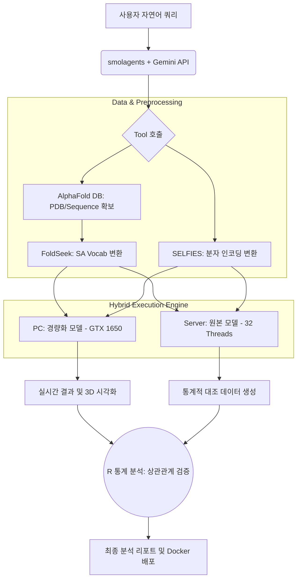

# [Capstone Project] Agentic FusionDTI: 저사양 환경을 위한 지능형 신약 재창출 플랫폼

## 1. 프로젝트 개요 (Overview)
본 프로젝트는 2025년 최신 SOTA(State-of-the-Art) 모델인 **FusionDTI**와 **smolagents**를 결합하여, 전문가용 바이오 분석 도구를 일반 연구자도 쉽게 사용할 수 있도록 지능화 및 경량화한 **엔드 투 엔드(End-to-End) 분석 플랫폼** 구축을 목표로 함.

## 2. 기존 방법론의 한계 (Limitations)
*   **높은 하드웨어 장벽:** 최신 DTI 모델(예: SaProt-650M)은 고성능 GPU(VRAM 12GB 이상)를 필수로 요구하여 보급형 환경에서 구동이 불가능함.
*   **인터페이스의 복잡성:** 대부분의 SOTA 모델은 CLI(터미널) 기반으로, 비전공자가 SMILES 문자열이나 아미노산 서열을 직접 다루기에 진입장벽이 높음.
*   **설명력(Explainability) 부족:** 모델이 산출한 결합 점수(Affinity Score)에 대한 생물학적/통계적 근거 제시가 미흡함 (Black-box 모델).

## 3. 핵심 가설 (Core Hypothesis)
> "최신 DTI 모델을 **4-bit 양자화(Quantization)** 및 **경량 백본(SaProt-35M)**으로 최적화하더라도, 원본 모델과의 **Pearson 상관계수(r)가 0.8 이상**을 유지한다면, 보급형 디바이스(GTX 1650) 기반의 실시간 신약 탐색 보조 도구로서 충분한 유효성을 가질 것이다."

## 4. 연구 기여도 (Contribution)
*   **AI 민주화 (Democratization):** 고가의 서버 없이 GTX 1650(4GB) 수준의 보급형 GPU에서 최신 바이오 AI 연구가 가능한 환경 제안.
*   **지능형 워크플로우 자동화:** 자연어 질의를 통해 데이터 수집(AlphaFold DB), 전처리, 분석, 시각화까지 에이전트가 자율적으로 수행하는 시스템 구축.
*   **신뢰성 검증 연구:** 경량화 모델과 SOTA 원본 모델 간의 통계적 비교 분석(R 활용)을 통해 공학적 트레이드오프(Trade-off) 데이터 확보.

## 5. 기술 스택 (Tech Stack)
*   **Model:** FusionDTI (2025 SOTA), SaProt (Protein Encoder)
*   **Agent:** smolagents (Hugging Face), Gemini 1.5 Flash (Free API)
*   **Optimization:** bitsandbytes (4-bit/8-bit Quantization), ESM-2 (35M Backbone)
*   **Backend/Frontend:** Python, Streamlit, FastAPI
*   **Infrastructure:** Docker, WSL2, Linux Server (32-Threads CPU)
*   **Statistics:** R (Pearson Correlation, T-test, RMSE)

## 6. 분석 파이프라인 및 플로우차트 (Pipeline)

### 6.1. 데이터 흐름
1.  **User Query:** "타이레놀이 탈모 단백질에 효과가 있을까?" (자연어 입력)
2.  **Agent Analysis:** 질의 분석 후 UniProt/AlphaFold DB에서 타겟 서열 및 3D PDB 추출.
3.  **Preprocessing:** SMILES → SELFIES 변환 및 PDB → SA Vocabulary(FoldSeek) 변환.
4.  **Inference:** 경량화된 FusionDTI 엔진으로 결합 점수 산출.
5.  **Reporting:** 3D 구조 시각화 및 에이전트의 결과 해석 리포트 생성.

### 6.2. 시스템 플로우차트

## 7. 실험 과정 (Experimental Process)
1.  **Step 1 (Baseline):** 연구실 Linux 서버(CPU 32스레드)에서 원본 SaProt-650M 모델을 구동하여 DAVIS 데이터셋의 Reference Score 확보.
2.  **Step 2 (Optimization):** 연구실 PC(GTX 1650)에서 SaProt-35M 모델에 4-bit 양자화를 적용하여 메모리 점유율 및 추론 속도 최적화.
3.  **Step 3 (Agentic Integration):** smolagents를 활용하여 AlphaFold DB API 연동 및 데이터 전처리 도구(Tool) 패키징.
4.  **Step 4 (Validation):** 서버 결과(원본)와 PC 결과(경량화) 사이의 Pearson 상관분석 수행 (R 언어 활용).
5.  **Step 5 (Deployment):** 전체 시스템을 Docker 이미지로 빌드하여 환경 격리 및 배포 재현성 확보.

## 8. 기대 결과 및 결론 (Expected Conclusion)
*   **기술적 성과:** VRAM 사용량을 80% 이상 절감하면서도 SOTA 모델의 예측 경향성을 유지하는 경량화 엔진 완성.
*   **실용적 성과:** 복잡한 바이오 데이터를 몰라도 자연어로 신약 후보 물질을 탐색할 수 있는 '지능형 연구 비서' 구현.
*   **결론:** 본 프로젝트는 최신 AI 기술의 학술적 가치와 공학적 최적화, 그리고 에이전트를 통한 사용자 경험 혁신을 통합함으로써, 제한된 자원 환경에서의 고성능 서비스 구축 가능성을 입증함.
